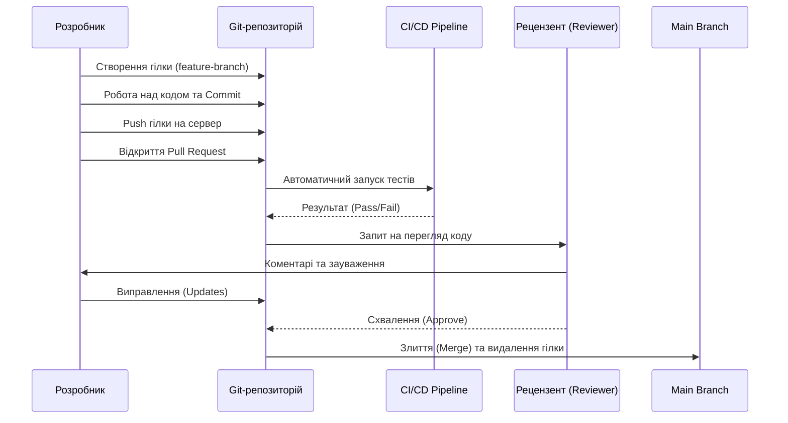
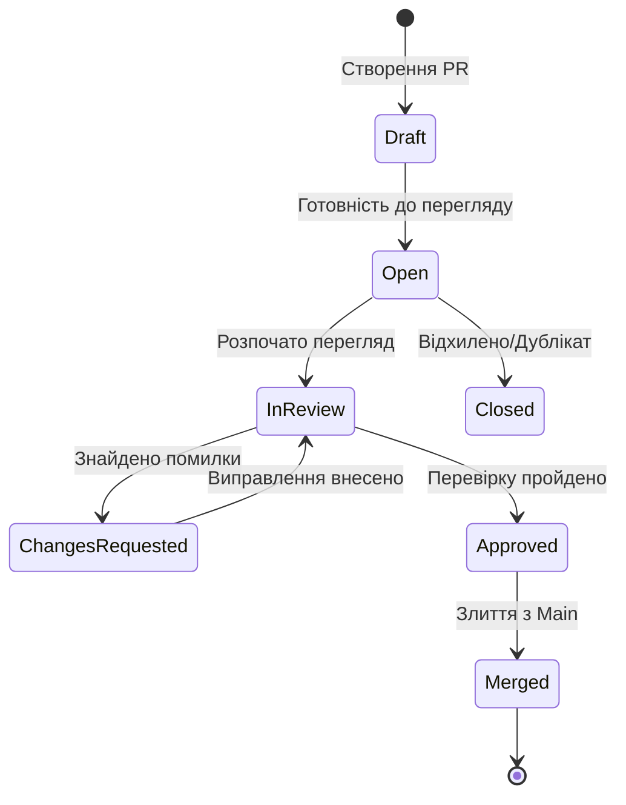

# Життєвий цикл Pull Request (PR): Стандарти та Процеси

Цей документ описує еталонний процес розробки через Pull Request (PR), що забезпечує високу якість коду, безпеку та ефективну співпрацю в команді.

---

## 1. Концептуальна схема процесу

Процес PR — це механізм контролю якості, який дозволяє перевірити зміни в коді перед їх об'єднанням з основною гілкою проєкту.

### Діаграма послідовності (Sequence Diagram)

## Стани Pull Request

